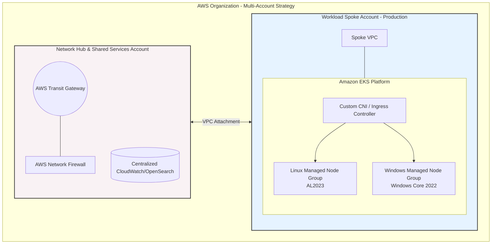
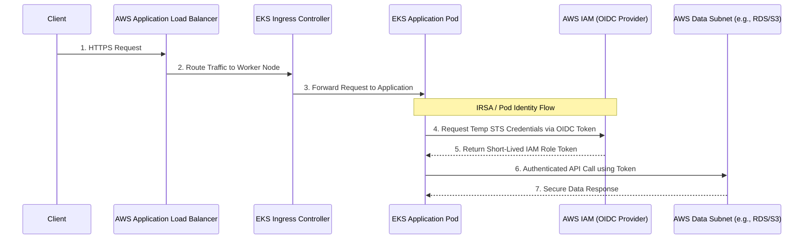

# Executive Architectural Reference

## 1. Problem Definition
The client currently operates a monolithic, hybrid workload (Linux API services and Windows Server enterprise services) within a single, flat AWS account. This architecture introduces severe risks:
* **Blast Radius & Security:** The lack of environment isolation and overlapping VPC CIDRs creates a massive security and operational risk; a single compromised instance or misconfiguration could impact production.
* **Operational Inefficiency:** Manual deployments and fragmented logging (split between Windows Event Viewer and Linux log files) have resulted in an unacceptably high Mean Time to Resolution (MTTR) during outages.

## 2. Strategic Recommendations & Target Architecture
To achieve a zero flat-account blast radius and sub-15-minute MTTR, we recommend a complete landing zone redesign and platform modernization:

* **Multi-Account Landing Zone:** Transition to an AWS Organization with dedicated accounts for Management, Shared Services/Network Hub, Security/Logging, and Workload Spokes (Dev, Staging, Prod). 
* **Hub-Spoke Networking:** Implement AWS Transit Gateway for centralized, micro-segmented routing, utilizing layered subnets (Public Ingress, App/Compute Private, Data Private) to strictly control traffic flow.
* **Hybrid EKS Compute:** Migrate workloads to Amazon EKS utilizing Managed Node Groups. By leveraging heterogeneous compute, both Linux (Amazon Linux 3) and Windows Server (Windows Core 2022) worker nodes can run within the same orchestrated environment while retaining strict namespace and data subnet isolation.
* **Unified Observability & Diagnostics:** Implement an automated diagnostic workflow utilizing AWS Systems Manager (SSM) Run Command to query logs without SSH/RDP access, shipping telemetry to a centralized CloudWatch/OpenSearch stack.

## 3. Trade-Off Matrix
| Architectural Decision | Pro | Con / Mitigation |
| :--- | :--- | :--- |
| **EKS for Hybrid Compute** | Unifies orchestration for both Linux and Windows workloads; simplifies CI/CD. | High learning curve for Windows on Kubernetes. *Mitigation: Standardize Helm charts and use AWS managed AMIs.* |
| **Transit Gateway (TGW)** | Highly scalable hub-and-spoke networking; centralizes security appliance routing. | Additional hourly cost per attachment. *Mitigation: Offset by utilizing cost-effective Graviton nodes for Linux compute.* |
| **SSM Run Command** | Eliminates the need for bastion hosts and direct SSH/RDP access. | Requires strict IAM policies. *Mitigation: Implement explicit SCPs and role boundaries.* |

## 4. End-to-End Request Flow
1. **Ingress:** Client request hits the AWS Application Load Balancer via the Public Ingress Subnet.
2. **Compute:** Traffic is routed to the isolated App/Compute Private Subnet, terminating on the EKS custom Ingress Controller.
3. **Identity:** The EKS Pod Identity assumes an IAM role via IRSA to securely authorize actions without static credentials.
4. **Data:** Application interacts with data stores residing in the strictly isolated Data Private Subnet.

## 5. Architecture Diagrams

### Multi-Account & Hub-Spoke Topology

### EKS Ingress & Pod Identity Auth Flow
